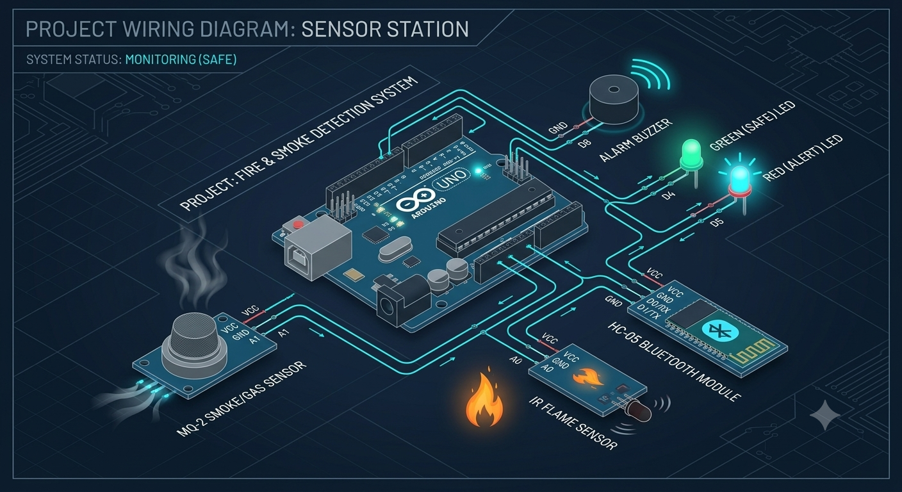

# ⚡ Intelligent Fire & Smoke Detection System with Bluetooth Telemetry

> **A rugged, Arduino-based safety system designed for real-time hazard monitoring, localized alerts, and interactive wireless control.**

---

## 📌 Project Overview

This project implements an intelligent, multi-stage fire and smoke detection system using an Arduino Uno. By integrating diverse analog sensors (optical and gas) with distinct acoustic and visual output engines, it provides early warning detection while minimizing false positives. The system features a non-blocking architecture for responsive alerts, a safety latching mechanism for fire incidents, and a robust Bluetooth serial command interface for remote diagnostics and control.



---

## 🛠 Features & System Intelligence

### 1. Advanced Hazard Monitoring
* **Dual-Sensor Fusion:** Combines data from an **IR Optical Flame Sensor** (immediate detection of open flames) and an **MQ-2 Smoke/Gas Sensor** (early detection of combustible gases or slow-burning smoke).
* **Mandatory 10s Warm-Up Phase:** Upon power-on, the system enters a mandatory stabilization period. During this time, the red LED is ON, the system ignores sensor readings, and the MQ-2 internal heater reaches operating temperature, preventing common false alarms associated with cold gas sensors.

### 2. Differentiated Warning Systems
* **Acoustic Fingerprints:** The system utilizes two separate piezo buzzers driven by a custom non-blocking cadence engine (`millis()`). They generate distinct pulse patterns to allow acoustic identification of the hazard type:
  * **Fire Alert:** Very fast, high-urgency **120ms** pulse train on Pin 9.
  * **Smoke Alert:** Slower, continuous **250ms** rhythmic cadence on Pin 10.
* **Visual Status LEDs:** A green "SYSTEM SAFE" LED (Pin 2) is active during normal operation. A red "HAZARD ACTIVE" LED (Pin 3) triggers immediately during warm-up or any detected alert.

### 3. Critical Latching & Reset (Fire Safety)
* **Fire Latch:** A flame detection event is considered critical. Upon trigger, the alarm system (Red LED + Fire Buzzer) **locks into the active state** even if the flame disappears. This ensures the hazard is physically inspected and addressed.
* **Manual Reset (`r`/`R`):** The fire alarm can only be cleared by sending an explicit 'reset' command via the Bluetooth/Serial interface.
* **Auto-Clearing Smoke Alarm:** The smoke alarm is non-latching; it automatically deactivates when ambient smoke concentrations drop below the calibrated threshold.

### 4. Bluetooth Remote Telemetry
* Fully interactive control via an HC-05 (or HC-06) Bluetooth module operating at **9600 Baud**. This allows integration with smartphone apps (e.g., "Bluetooth Serial Terminal") for off-site monitoring.

---

## 📡 Bluetooth / Serial Command Dictionary

All commands are single-character, case-insensitive, and work over both USB Serial and Bluetooth.

| Command | Function | Description & Expected System Response |
| :--- | :--- | :--- |
| **`r` / `R`** | **Reset Fire Latch** | Clears the active fire latching state, mutes the flame buzzer, and returns the system to MONITORING. *Response:* `=> FIRE LATCH CLEARED` |
| **`s` / `S`** | **Health Report** | Prints a comprehensive status snapshot including system uptime, current sensor states (SAFE/ACTIVE), and incident counters for this power cycle. |
| **`t` / `T`** | **Diagnostic Test** | Initiates a quick, 2-second sequence cycling both LEDs and both buzzers to verify physical hardware functionality. |
| **`m` / `M`** | **Emergency Mute** | Temporarily **silences all alarms for exactly 60 seconds**. Useful during known non-hazard events (e.g., cooking smoke). The Red LED remains ON to show the hazard still exists. |

---

## 📊 Hardware Pin Assignments & Wiring Specs

The project wiring diagram (top of document) illustrates these connections.

| **Component Category** | **Module** | **Arduino Pin** | **Signal Type** | **Threshold / Logic** |
| :--- | :--- | :--- | :--- | :--- |
| **SENSORS** | IR Flame Sensor | **`A0`** | Analog Input | Active Hazard = **Value < 500** |
| | MQ-2 Smoke Sensor | **`A1`** | Analog Input | Active Hazard = **Value > 110**\* |
| **OUTPUTS (LED)**| Status LED (Green) | **`Pin 2`** | Digital Output | `HIGH` = Safe; `LOW` = Alert/Warm-up |
| | Hazard LED (Red) | **`Pin 3`** | Digital Output | `HIGH` = Alert or 10s Warm-up |
| **OUTPUTS (AUDIO)** | Primary Flame Buzzer| **`Pin 9`** | Digital Output | `millis()` driven: **120ms Pulse** |
| | Secondary Smoke Buzzer| **`Pin 10`**| Digital Output | `millis()` driven: **250ms Pulse** |
| **WIRELESS COMM** | HC-05 (BT Module) RX| **`Pin 1 (TX)`**| Hardware Serial| UART communication @ **9600 Baud** |
| | HC-05 (BT Module) TX| **`Pin 0 (RX)`**| Hardware Serial| Connection requires D0(Arduino) $\rightarrow$ TX(HC05) |

> *\*Thresholds are initial defaults. Physical environment calibration via the onboard sensor potentiometers is recommended. Consult `docs/sensor-calibration.md`.*

---

## 📁 Repository Map

```text
├── assets/
│   └── wiring_diagram.png         # High-resolution schematic and visual overview.
├── docs/
│   └── sensor-calibration.md      # Step-by-step guide for setting baseline thresholds and tuning sensors.
├── src/
│   ├── fire_smoke_detection.ino   # Core C++ (Arduino) system firmware.
│   └── README.md                  # Specific technical breakdown of code structure and non-blocking timing.
└── README.md                      # (You are here) Main project description and operational reference.